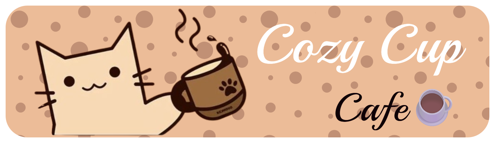
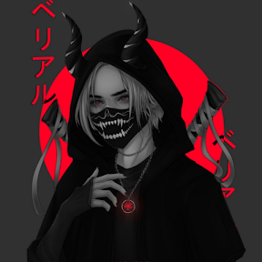

## Project Description
This project is a website where it contains all the details for our Cafe, "Cozy Cup"

## Features
- Complete Menu of our premium coffee brews along with the ingredients used
- Full details of our cafe's journey to success
- A contact list, for inquiries and concerns

## Screen Captures
Below are screen shot's of our project's progress

## About the Authors

<table>
    <tr>
        <td align="center">
            
             
            <b>Name: Charles Joaquin N. Alabastro</b>
             
            <b>Email: charlesalabastroo@gmail.com</b>
             
            
            
        </td>
        <td align="center">
            
             
            <b>Name: Daven Rupert Y. Villar</b>
             
            <b>Email: davenvillar@gmail.com</b>
             
            
            
        </td>
    </tr>
</table>

